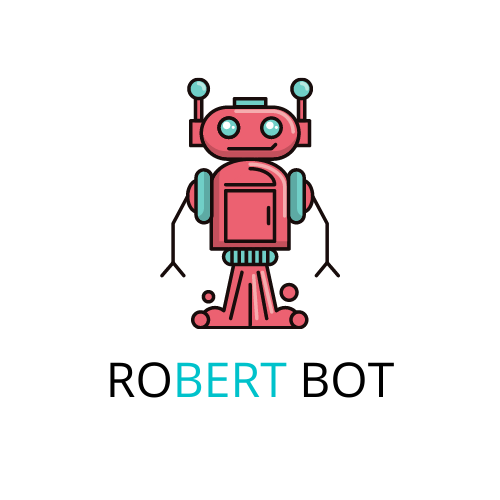
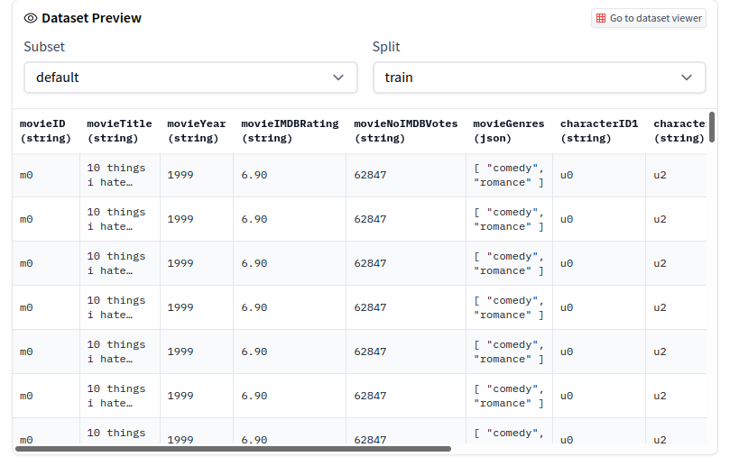
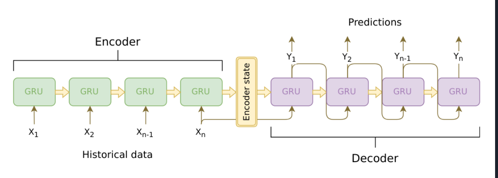
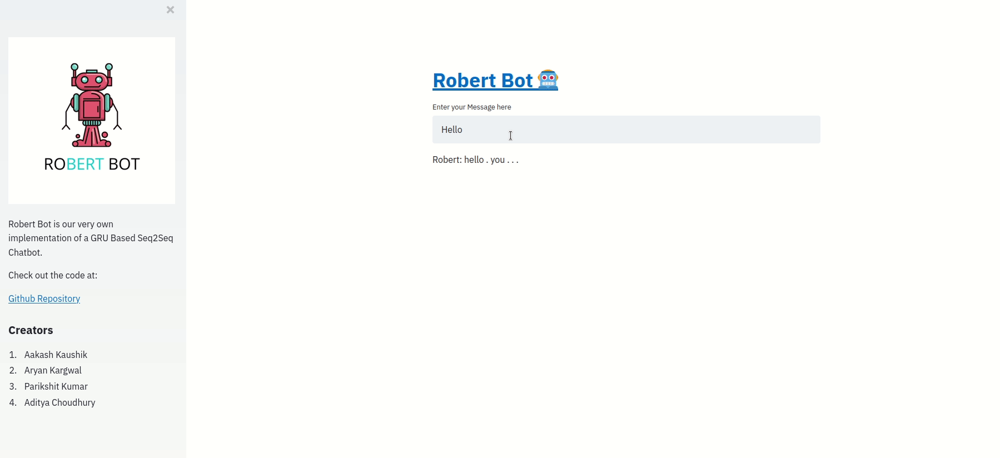

# robert-heroku 
[](https://www.python.org/)
[](https://opensource.org/licenses/Apache-2.0)
[](https://www.repostatus.org/#wip)
<br>

Robert Bot exists with the purpose of bridging gaps between humans and AI through our very own versatile, deployable non-rule based chatbot. We wish to work on the GRU based Seq2Seq model to further use for tasks in the medical field.

## Tech-Stack

For this particular implementation we have worked out very own code from scratch for the sequential model by using PyTorch and further to provide a face to the project have used Streamlit.

Set up the python environment yourself by first cloning the repo<br>
```git clone https://github.com/Aakash-kaushik/robert-heroku```

Use the following command to install the libraries from [requirements.txt](requirements.txt)<br>
```pip install -r requirements.txt```

## Dataset



For this project we decided to go for the Cornell Movie Dialogue Corpus, which served as a very good dataset because of the following features:
- 220,579 conversational exchanges between 10,292 pairs of movie characters
- involves 9,035 characters from 617 movies
- in total 304,713 utterances

## Architecture



### Model
Chatbot is a sequence-to-sequence (seq2seq) model. The goal of a seq2seq model is to take a variable-length sequence as an input, and return a variable-length sequence as an output using a fixed-sized model.

## How can you run it

Set up the python environment yourself by first cloning the repo<br>
```git clone https://github.com/Aakash-kaushik/robert-heroku```

Use the following command to install the libraries from [requirements.txt](requirements.txt)<br>
```pip install -r requirements.txt```

Run the webapplication<br>
```streamlit run app.py```

## Bot in Action



## License 
This project is under the Apache License. See [LICENSE](LICENSE) for Details.

